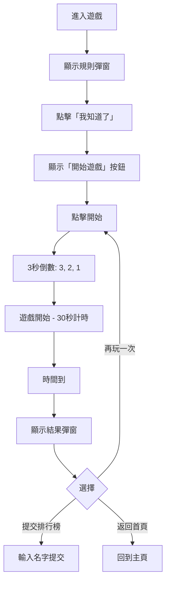

# 箭頭衝刺 - 設計框架文檔

## 遊戲概述
**名稱**：箭頭衝刺 (Arrow Rush)  
**類型**：反應速度 + 節奏感測試  
**時長**：30 秒  
**目標**：在時間內按下正確的方向鍵，獲得最高分數與連擊

---

## UI 結構

### 1. 頁面佈局

```
┌─────────────────────────────────────┐
│  ← 返回首頁    箭頭衝刺    ❓ 規則  │
├─────────────────────────────────────┤
│                                     │
│         [開始遊戲按鈕]              │  ← 初始狀態
│                                     │
├─────────────────────────────────────┤
│  分數: 0    時間: 30s    連擊: 0   │  ← 遊戲進行中
│                                     │
│         [遊戲畫布 Canvas]           │
│                                     │
│         [再玩一次按鈕]              │  ← 遊戲結束後
└─────────────────────────────────────┘
```

### 2. 遊戲流程



---

## 設計元素

### 1. 規則彈窗 (Rules Modal)

#### 結構
```html
<div class="modal">
  <div class="modal-content card">
    <div class="modal-header">
      <h2>📜 遊戲規則</h2>
      <button class="close-modal">&times;</button>
    </div>
    <div class="modal-body">
      <ol>
        <li>點擊「開始遊戲」開始 30 秒倒數計時</li>
        <li>螢幕中間顯示當前箭頭與即將到來的 5 個箭頭</li>
        <li>按下與最下方（當前）箭頭相符的方向鍵</li>
        <li>正確按下：+10 分，連擊 +1</li>
        <li>按錯：-5 分，連擊歸零，僵直 0.5 秒</li>
        <li>每 5 連擊有分數加成！</li>
      </ol>
      <button class="btn btn-primary">我知道了！</button>
    </div>
  </div>
</div>
```

#### 樣式特點
- **背景**：半透明黑色 + 模糊效果 (`backdrop-filter: blur(4px)`)
- **卡片**：白色背景，粗黑邊框，陰影效果（Neubrutalism 風格）
- **按鈕**：主色調橙色 (`#F97316`)，懸停/點擊有位移動畫

#### 行為
- 進入遊戲時自動顯示
- 點擊 `×`、「我知道了」或背景區域關閉
- 關閉後顯示「開始遊戲」按鈕

---

### 2. 開始遊戲按鈕

#### 設計
```css
.btn-large {
    font-size: var(--text-2xl);      /* 大字體 */
    padding: var(--space-6) var(--space-12);
    background: var(--primary);       /* 橙色 #F97316 */
    color: white;
    border: 3px solid #000;
    box-shadow: 8px 8px 0 var(--shadow-color);
    font-weight: bold;
    cursor: pointer;
}
```

#### 互動效果
- **Hover**：位移 `translate(4px, 4px)`，陰影縮小
- **Active**：位移 `translate(8px, 8px)`，陰影消失
- **點擊後**：隱藏按鈕，顯示遊戲畫布，開始 3 秒倒數

---

### 3. 遊戲畫布 (Canvas)

#### 尺寸
- **寬度**：600px
- **高度**：400px
- **邊框**：5px 黑色實線
- **陰影**：10px 10px 0 黑色

#### 內容顯示

##### 倒數階段 (3秒)
```
┌─────────────────┐
│                 │
│        3        │  ← 橙色大字
│                 │
└─────────────────┘
```

##### 遊戲進行中
```
┌─────────────────┐
│   ↑ ↓ ← → ↑    │  ← 即將到來的箭頭（小）
│                 │
│       ↑         │  ← 當前箭頭（大）
│                 │
└─────────────────┘
```

#### 視覺回饋
- **正確按鍵**：
  - Canvas 邊框閃爍綠色光暈
  - 浮動分數文字 `+10` 向上飄動
  - 動畫時長：200ms
  
- **錯誤按鍵**：
  - Canvas 震動效果
  - 紅色閃爍
  - 僵直 0.5 秒（無法操作）

---

### 4. 資訊欄 (Info Bar)

#### 結構
```html
<div class="info-bar">
  <div class="info-item">
    <span class="info-label">分數</span>
    <span class="info-value">0</span>
  </div>
  <div class="info-item">
    <span class="info-label">時間</span>
    <span class="info-value">30s</span>
  </div>
  <div class="info-item">
    <span class="info-label">連擊</span>
    <span class="info-value combo">0</span>
  </div>
</div>
```

#### 樣式
- **容器**：白色背景，黑色邊框，陰影
- **標籤**：小字體，灰色
- **數值**：大字體，粗體，橙色（連擊為紫色）
- **最小寬度**：120px

---

### 5. 結果彈窗 (Leaderboard Modal)

#### 結構
```html
<div class="modal">
  <div class="modal-content card">
    <div class="modal-header">
      <h2>🏆 遊戲結束</h2>
      <button class="close-modal">&times;</button>
    </div>
    <div class="modal-body">
      <!-- 成績顯示 -->
      <p>你的分數: <strong>1250</strong></p>
      
      <!-- 提交表單 -->
      <input type="text" placeholder="輸入名字" maxlength="15">
      <button class="btn btn-primary">提交</button>
      <div id="submit-status"></div>
      
      <!-- 排行榜 -->
      <h3>當前排行榜</h3>
      <div id="leaderboard-display">
        <table>
          <thead>
            <tr>
              <th>排名</th>
              <th>名字</th>
              <th>分數</th>
            </tr>
          </thead>
          <tbody>
            <tr>
              <td><strong>🥇 1</strong></td>
              <td>玩家A</td>
              <td><strong>1500</strong></td>
            </tr>
          </tbody>
        </table>
      </div>
      
      <!-- 操作按鈕 -->
      <div class="button-group">
        <a href="../../index.html" class="btn btn-secondary">← 返回首頁</a>
        <button class="btn btn-primary">再玩一次 🎮</button>
      </div>
    </div>
  </div>
</div>
```

#### 排行榜樣式
- **表格**：全寬，邊框合併
- **表頭**：粗黑底線
- **排名**：前三名顯示獎牌 🥇🥈🥉
- **分數**：橙色粗體
- **最大高度**：300px，超出可滾動

#### 提交流程
1. 輸入名字（必填，最多 15 字元）
2. 點擊「提交」
3. 顯示「提交中...」
4. 成功：顯示 ✅ 已提交，刷新排行榜，禁用輸入
5. 失敗：顯示 ❌ 提交失敗，按鈕變為「重試」

---

## 互動設計

### 1. 按鈕點擊回饋

#### Canvas 點擊（開始遊戲前）
```css
#game-canvas:hover:not(.playing) {
    transform: translate(5px, 5px);
    box-shadow: 5px 5px 0 var(--shadow-color);
}

#game-canvas.active:not(.playing) {
    transform: translate(10px, 10px);
    box-shadow: 0 0 0 var(--shadow-color);
}
```

#### 行為
- **mousedown**：添加 `.active` 類
- **mouseup**：移除 `.active` 類，觸發開始遊戲
- **mouseleave**：移除 `.active` 類

### 2. 遊戲中動畫

#### 正確擊中動畫
```css
#game-canvas.hit-success {
    animation: hit-bounce 0.2s ease-out;
}

@keyframes hit-bounce {
    0%, 100% {
        box-shadow: 10px 10px 0 var(--shadow-color);
    }
    50% {
        box-shadow: 0 0 0 8px var(--success), 10px 10px 0 var(--shadow-color);
    }
}
```

#### 浮動分數文字
- **位置**：箭頭右側
- **顏色**：綠色 `#22C55E`
- **字體**：粗體 32px
- **動畫**：向上飄動 1 秒後消失
- **描邊**：黑色 3px（提高可見度）

---

## 響應式設計 (RWD)

### 策略
- **桌面優先**：主要針對 1024px+ 設計
- **固定高度**：`100vh`，禁止垂直滾動
- **允許水平滾動**：`overflow-x: hidden; overflow-y: auto`

### 斷點

#### 手機 (< 768px)
```css
@media (max-width: 767px) {
    /* Canvas 縮小 */
    #game-canvas {
        max-width: 350px;
        height: auto;
    }
    
    /* 資訊欄垂直排列 */
    .info-bar {
        flex-direction: column;
        gap: var(--space-2);
    }
    
    /* 按鈕全寬 */
    .btn-large {
        width: 100%;
    }
}
```

---

## 顏色系統

### 主色調
- **Primary (橙色)**：`#F97316`
- **Accent (紫色)**：`#A855F7`
- **Success (綠色)**：`#22C55E`
- **Error (紅色)**：`#EF4444`

### 中性色
- **背景**：`#FFF7ED` (淺橙)
- **表面**：`#FFFFFF`
- **文字**：`#18181B`
- **邊框**：`#000000`
- **陰影**：`#000000`

---

## 字體系統

### 字體家族
```css
--font-display: 'Fredoka', sans-serif;  /* 標題、按鈕 */
--font-body: 'Fredoka', sans-serif;     /* 內文 */
```

### 字體大小
```css
--text-sm: 0.875rem;    /* 12px - 標籤 */
--text-base: 1rem;      /* 14px - 內文 */
--text-lg: 1.125rem;    /* 16px */
--text-xl: 1.25rem;     /* 18px */
--text-2xl: 1.5rem;     /* 21px - 按鈕 */
--text-3xl: 1.875rem;   /* 26px - 數值 */
--text-4xl: 2.25rem;    /* 32px - 倒數 */
```

---

## 動畫時序

### 標準時長
- **快速**：150ms - 按鈕懸停
- **標準**：200ms - 擊中回饋
- **慢速**：300ms - 錯誤震動
- **倒數**：1000ms - 每秒更新

### Easing
- **ease-out**：按鈕點擊、動畫結束
- **ease-in-out**：平滑過渡

---

## 無障礙設計

### 鍵盤支援
- **方向鍵**：↑ ↓ ← → 控制遊戲
- **Enter**：開始遊戲（當按鈕聚焦時）
- **Esc**：關閉彈窗

### 視覺對比
- **文字對比度**：至少 4.5:1
- **邊框**：粗黑邊框（3-5px）提高可見度
- **陰影**：純黑色，清晰可辨

### 語義化 HTML
```html
<header class="game-header">
  <nav>
    <a href="...">返回首頁</a>
  </nav>
  <h1>箭頭衝刺</h1>
</header>

<main class="game-area">
  <section class="info-bar" aria-label="遊戲資訊">
    ...
  </section>
  <canvas id="game-canvas" aria-label="遊戲畫布">
    ...
  </canvas>
</main>
```

---

## 技術實作

### 核心技術
- **HTML5 Canvas**：遊戲渲染
- **Vanilla JavaScript**：遊戲邏輯
- **CSS3**：樣式與動畫
- **LocalStorage**：本地統計資料
- **Google Apps Script**：排行榜後端

### 關鍵函數

#### 遊戲初始化
```javascript
init() {
    this.canvas.addEventListener('mousedown', ...);
    this.canvas.addEventListener('mouseup', ...);
    window.addEventListener('keydown', ...);
    this.openRules(); // 顯示規則
}
```

#### 倒數計時
```javascript
showCountdown() {
    let countdown = 3;
    this.isCountingDown = true;
    
    // 立即顯示第一個數字
    this.drawCountdown(countdown);
    countdown--;
    
    const interval = setInterval(() => {
        if (countdown > 0) {
            this.drawCountdown(countdown);
            countdown--;
        } else {
            clearInterval(interval);
            this.startGamePlay();
        }
    }, 1000);
}
```

#### 動畫循環
```javascript
startAnimationLoop() {
    const animate = () => {
        if (this.isPlaying) {
            this.render();
            this.animationId = requestAnimationFrame(animate);
        }
    };
    animate();
}
```

---

## 效能優化

### Canvas 渲染
- 使用 `requestAnimationFrame` 而非 `setInterval`
- 僅在遊戲進行時執行動畫循環
- 遊戲結束時取消動畫幀

### 事件處理
- 使用事件委派減少監聽器數量
- 防抖處理高頻事件（如 resize）

### 資源載入
- 字體預載入：`<link rel="preload">`
- 腳本延遲載入：`defer` 屬性

---

## 測試檢查清單

### 功能測試
- [ ] 規則彈窗正確顯示與關閉
- [ ] 開始按鈕點擊啟動倒數
- [ ] 3 秒倒數正確顯示
- [ ] 方向鍵輸入正確識別
- [ ] 分數計算正確（+10/-5）
- [ ] 連擊系統正常運作
- [ ] 時間倒數至 0 結束遊戲
- [ ] 排行榜提交成功
- [ ] 再玩一次重置遊戲

### 視覺測試
- [ ] 按鈕懸停/點擊動畫流暢
- [ ] Canvas 擊中回饋明顯
- [ ] 浮動分數文字可見
- [ ] 彈窗居中顯示
- [ ] 排行榜表格排版正確

### 響應式測試
- [ ] 手機版 (375px)
- [ ] 平板版 (768px)
- [ ] 桌面版 (1024px+)
- [ ] 超寬螢幕 (1920px+)

### 瀏覽器測試
- [ ] Chrome
- [ ] Firefox
- [ ] Safari
- [ ] Edge

---

## 未來改進方向

### 遊戲性
- [ ] 難度選擇（簡單/普通/困難）
- [ ] 無盡模式（無時間限制）
- [ ] 成就系統
- [ ] 每日挑戰

### 視覺效果
- [ ] 粒子特效（擊中時）
- [ ] 背景音效與音樂
- [ ] 更豐富的動畫過渡
- [ ] 主題切換（日間/夜間）

### 社交功能
- [ ] 分享成績到社群媒體
- [ ] 好友排行榜
- [ ] 即時對戰模式

---

**文檔版本**：1.0  
**最後更新**：2026-02-04  
**維護者**：開發團隊
